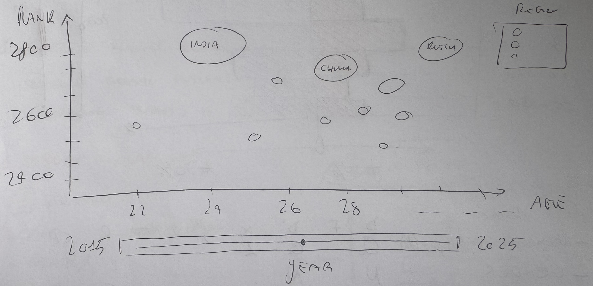
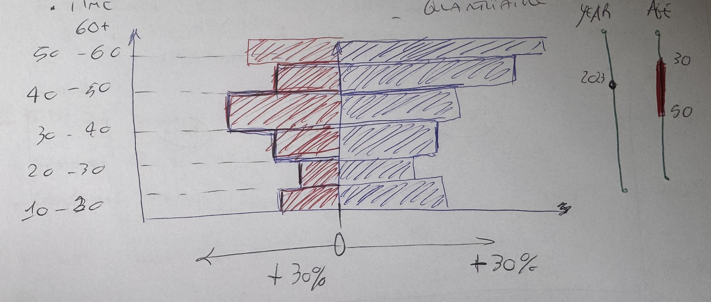

# Visual Design 
The two questions that i will use for the project will be: 
1) Question: How has the demographic composition of the global ranking changed in recent years?
    - Demographics and Gender Gap Analysis
    - Motivation: To verify if the game is becoming socially more inclusive or if it remains structurally dominated by specific demographic groups.
2) Question: Is there a correlation between the average age of a nation's players and its average competitive strength?
   - Generational Clash (Youth vs. Experience)
   - Motivation: To verify if the advent of modern training methods chess engines, online databases disproportionately favors nations with a lower average age compared to those relying on traditional experience.

## 1) Question: How has the demographic composition of the global ranking changed in recent years?

### Visual Mapping Specification

| Name                                 | D   | F   | D'  | X   | Y   | Z   | T   | R   |  —  | []  | CP                |
| :---                                 | :-: | :-: | :-: | :-: | :-: | :-: | :-: | :-: | :-: | :-: | :-:               |
| **% player per Gender**              | Q   |     |  Q  |  L  |     |     |     |     |     |     |                   |
| **Gender**                           | N   |     |  N  |     |     |     |     |  C  |     |     |                   |
| **Year**                             | Q   |  sl |  Q  |     |     |     |     |     |     |     |  slider           |
| **Age Range**                        | O   |  sl |  O  |     |  P  |     |     |     |     |     |  slider + click   |

similar graph: https://observablehq.com/@observablehq/plot-state-population-change

### Interactions 
- Year slider:
    - The user drags the slider to advance the timeline from one year to the other
    - The bars will smoothly extending or rectracting their lenght to reflect the changing percentage of player per gender over  the years 
- Age range slider:
    - A two sides slider which the user can use to show only the interval of ages wanted (es: 30-50)
    - the will be a zoom in ora zoom out on the selected age interval of the chess players.
- Age range click:
    - if one of the age range on the X-axis is selected the will be a zoom-in on that range 
    - The x-axis will show up the range selected by the previuos click, revealing the granular distribution for individual year within that range. 

### Design choices 
- Quantitative Data:     
    - % Player per gender -> Lenght(X-Axis) : the percentage of players to the lenght of the bats is the most accurate channel for quantitative data, allowing for a precise comparison of magnitudes between ganeders.
 
- Ordered data:
    - Age range -> Position(Y-Axis) : Age groups are mapped to the vertical axis beacuse positision is the strongest variable for the ordered data and because it creates a natural structure that mirrors biological growth and facilities the identification of trends such as the aging or rejuvenation of the population.

- Nominal data:
    - Gender -> Color Hue : Gender have only few color to be used. According to Bertin, color is excellent for the Selection of nominal categories enabling the user to instantly distinguish between the two groups without implying a hierarchical order. 

- The symmetry is used to facilitiating a direct comparison of the shapes of the two distributions 

### Sketches

## 2) Question: Is there a correlation between the average age of a nation's players and its average competitive strength? 

### Visual Mapping Specification

| Name                                 | D   | F   | D'  |  X  | Y   | Z   | T   | R   |  —  | []  | CP                |
| :---                                 | :-: | :-: | :-: | :-: | :-: | :-: | :-: | :-: | :-: | :-: | :-:               |
| **Rank Avg.**                        | O   |     |  O  |     |  P  |     |     |     |     |     |                   |
| **# Player**                         | Q   |     |  Q  |     |     |     |     |  S  |     |     |                   |
| **Year**                             | Q   |  sl |  Q  |     |     |     |     |     |     |     |  slider           |
| **Age Avg.**                         | Q   |     |     |  P  |     |     |     |     |     |     |                   |
| **Country**                          | N   |     |  N  |     |     |     |     |     |     |     |  Text             |
| **Region**                           | N   |     |  N  |     |     |     |     |  C  |     |     |  Legend           |

similar graph: https://observablehq.com/@observablehq/plot-wealth-health-nations

### Interactions 
- Year slider:
    - The user drags the slider to change the displayed year 
    - The bubbles animaate, interpolating their position and size to reflect the data of the selected year
- Click on the region:
    - The user clicks on a region in the legend
    - All the bubbles that belongs to the selected regione will be higlighted wihle other bubbled became semi-trasparent 
- Hover highlights on region to select one only
    - the user hovers the mouse over a specific bubble
    - the name of the region show up in the background to better show the highlighted datas 
### Design Choice 
- Quantitative data: 
    - Age Avg. -> Position X-Axis : position is the best visual channel for Quantitative and ordered data. 
    - Rank Avg. -> Position Y-Axis : as for the Age Avg. the position is used for the most important Quantitative data
    - #Player -> Size : the number of player is mapped to the range of the circonference. This allows users to immediately wight the importance of a data point. 
- Nominal data: 
    - Region -> Hue : The use of colors is restricted to the mapping of the 7 continents, which is the maximum number of variables that could be mapped for bertin. 

- The Proximity of bubbles indicates that they share similar charachteristics in age and strenght.

### Sketches

